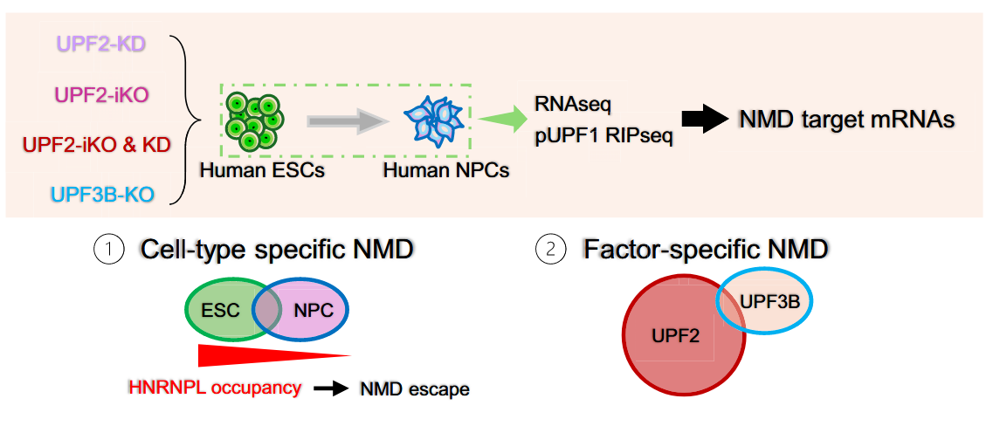
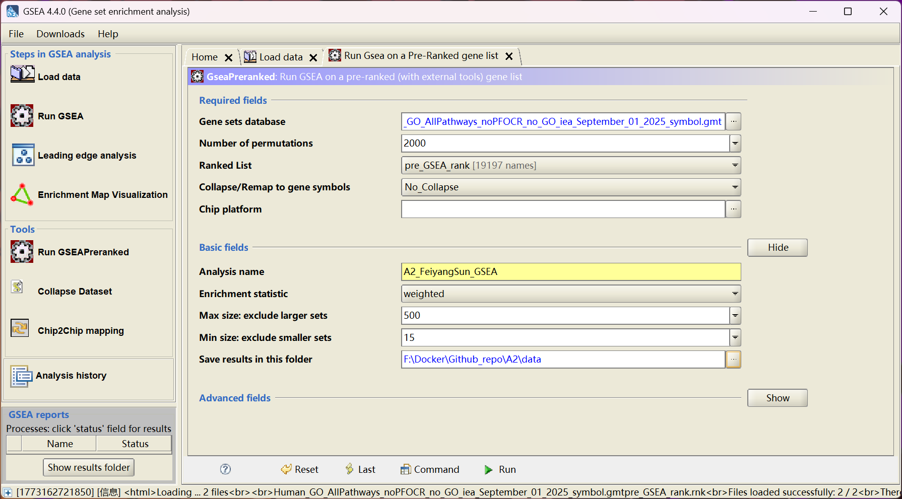
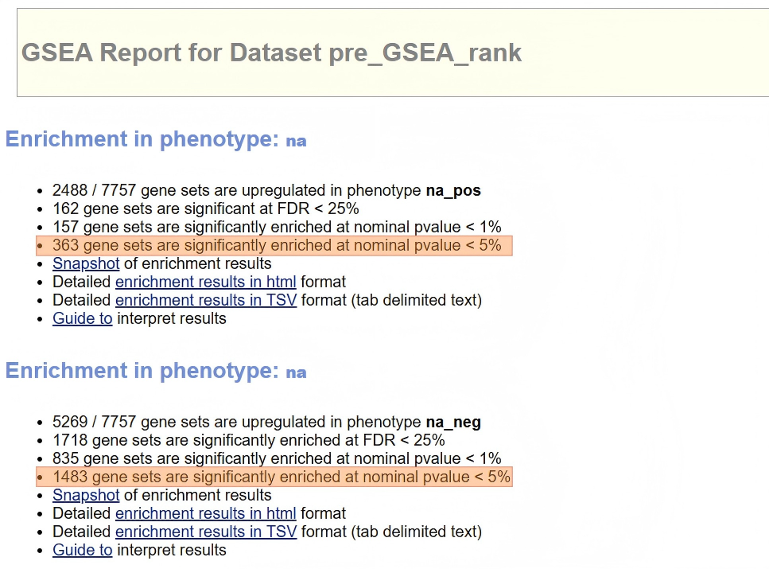
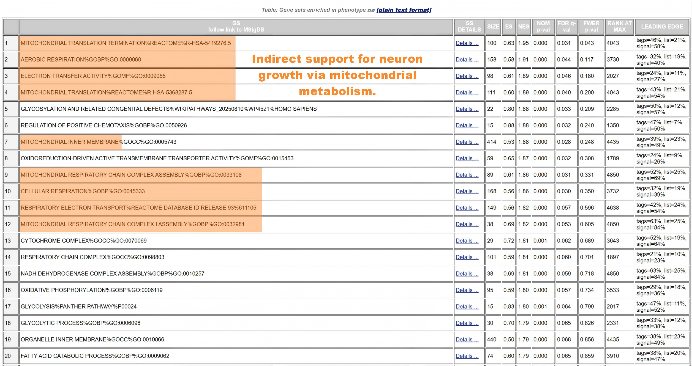
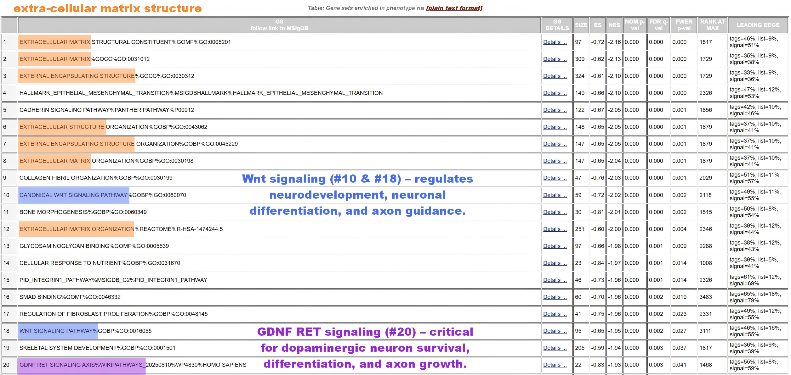
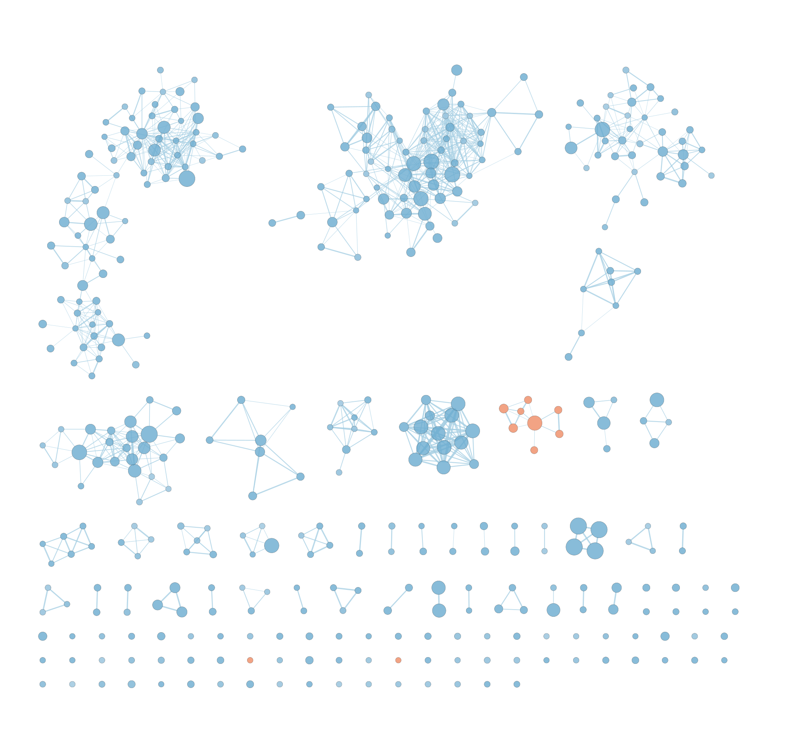
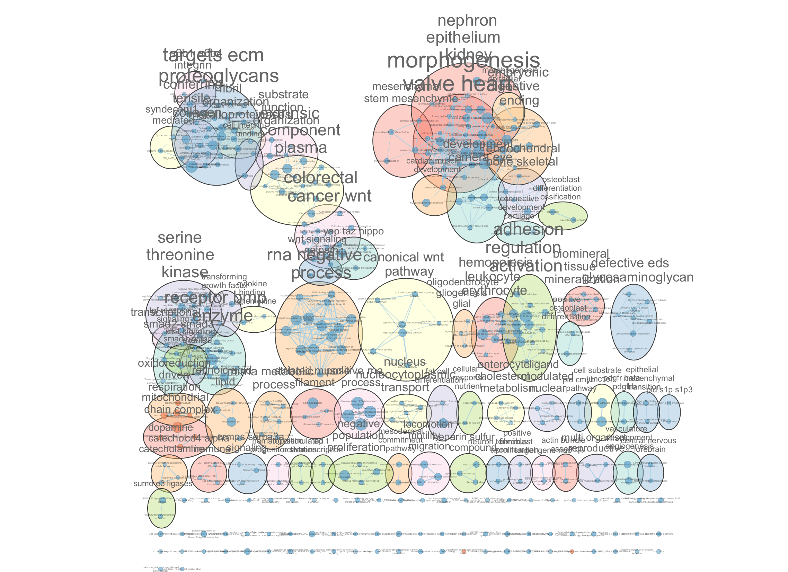
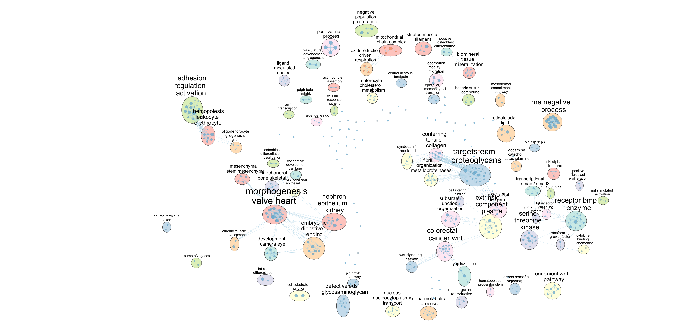
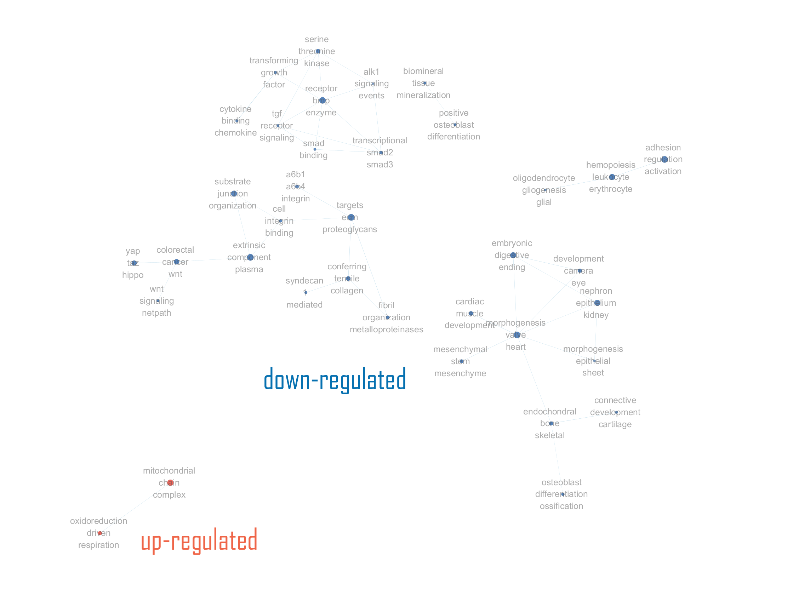

```{r setup, include=FALSE}
knitr::opts_chunk$set(message = FALSE, warning = FALSE)
```

# 0 Package installation check {.unnumbered}
```{r package check, warning = FALSE}
# Check installation
if(!requireNamespace("knitr", quietly = TRUE)) {
  install.packages("knitr")
}
if(!requireNamespace("dplyr", quietly = TRUE)) {
  install.packages("dplyr")
}
if(!requireNamespace("readr", quietly = TRUE)) {
  install.packages("readr")
}
if(!requireNamespace("rmarkdown", quietly = TRUE)) {
  install.packages("rmarkdown")
}
if(!requireNamespace("tidyr", quietly = TRUE)) {
  install.packages("tidyr")
}
if(!requireNamespace("tibble", quietly = TRUE)) {
  install.packages("tibble")
}
if(!requireNamespace("BiocManager", quietly = TRUE)) {
  install.packages("BiocManager")
}
if(!requireNamespace("ggplot2", quietly = TRUE)) {
  install.packages("ggplot2")
}

# Attach
library(knitr)
library(dplyr)
library(readr)
library(rmarkdown)
library(tidyr)
library(tibble)
library(BiocManager)
library(ggplot2)
```

# Introduction

In [Assignment 1](https://bcb420-2026.github.io/Feiyang_Sun/A1/A1_FeiyangSun.html), I selected the RNA-seq dataset from a study [@tan_cell_2025] investigating how nonsense-mediated RNA decay is regulated in a cell type-specific manner during human neural development  [@karousis_nonsense-mediated_2016].

## Dataset information
The dataset used in this analysis is GEO accession: **GSE263406**, a publicly available RNA sequencing dataset generated from Homo sapiens cells and released on May 21, 2025. This study [@tan_cell_2025] investigates the role of nonsense-mediated RNA decay (NMD), a conserved RNA quality-control pathway that regulates the stability and turnover of messenger RNAs. NMD plays an important role in gene expression regulation and is involved in multiple biological processes, including development and disease. The dataset focuses on identifying RNAs targeted by the NMD factor UPF3B [@Kadlec2004] during neural differentiation. 



Specifically, bulk RNA-seq was performed on neural progenitor cells (NPCs) differentiated from human embryonic stem cells (hESCs). The experimental design compares two groups: a **control (Ctrl)** group and a **UPF3B knockout (UPF3B-KO)** group. By comparing gene expression profiles between these groups, the study aims to identify transcripts whose stability or abundance is affected by the loss of UPF3B. This dataset provides insight into how NMD sensitivity can change depending on cellular context [@Buchwald2010], particularly during the transition from pluripotent stem cells to neural progenitor cells, and helps reveal how RNA-binding proteins may contribute to cell type-specific regulation of RNA decay.

The full dataset (after simple filtering) contains 43884 genes and 12 samples: <br>
- **(Ctrl_1-6)**: six control replicates where the UPF3B gene is intact and expressed. <br>
- **(UPF3B.KO_1-6)**: six replicates where UPF3B gene has been genetically disrupted (knockout).

See [Figure](https://bcb420-2026.github.io/Feiyang_Sun/A1/A1_FeiyangSun.html#visualizing-library-sizes-across-samples) in the A1 html file.

## Dataset processing
The bulk mRNA-seq dataset used in this analysis was obtained from GEO and accessed via the GEOquery package in R. Genes with no expression across all samples were removed, leaving 43,884 genes across 12 samples. Library sizes were visualized to assess sample consistency, and Ensembl gene IDs were mapped to HGNC symbols using the `biomaRt` package [@biomaRt], resulting in 31,282 successfully annotated genes. Lowly expressed genes were filtered with `edgeR`’s *filterByExpr()* [@edgeR], retaining **19,197** genes for downstream analysis.

Normalization was performed using the TMM (Trimmed Mean of M-values) method [@robinson_scaling_2010] to adjust for differences in library size and sequencing depth, assuming most genes are not differentially expressed. Raw count distributions were evaluated using log2-transformed boxplots and density plots, which highlighted potential outliers and confirmed consistency across replicates. Post-normalization comparisons showed improved uniformity in expression distributions, preparing the dataset for subsequent differential expression analysis.

## Differential expression analysis
Differential expression analysis of TMM-normalized log2 CPM values showed clear separation between control and UPF3B knockout NPC samples in multidimensional scaling plots. The BCV plot indicated low variability among replicates (common dispersion ~0.1). 

Using an **FDR cutoff of 0.05** and applying an additional threshold of **|log2FC| > 1** yielded 1209 high-confidence genes. UPF3B knockout led to more down-regulated genes (n = 727) than up-regulated (n = 482), suggesting a primarily positive regulatory role in NPCs and highlighting its cell type-specific effects. [Volcano plot.](https://bcb420-2026.github.io/Feiyang_Sun/A1/A1_FeiyangSun.html#volcano-plot)


# Over-representation analysis (ORA)

Here, we perform over-representation analysis (ORA) [@khatri2012ORA] using package `gprofiler2` on the significant genes identified in A1, focusing on biologically relevant gene sets.

## Importing dataset from A1

In the A1 analysis file, additional code was added to identify significant genes using an FDR cutoff of 0.05 and an additional threshold of |log2FC| > 1. These filtered genes were then exported as a CSV file to the `A2/data` directory, making them readily available for subsequent analyses in the code chunk below. Subsets for up-regulated and down-regulated genes are also stored here.

```{r import dataset from a1, warning = FALSE}
library(dplyr)

setwd("/home/rstudio/projects/A2")

# read in significant genes list exported from Assignment 1
sig_genes_A1 <- read.csv("data/sig_genes.csv", stringsAsFactors = FALSE)

# set into different subsets
up_genes <- sig_genes_A1 %>%
  filter(logFC > 0)
up_genes_names <- up_genes$gene_name

down_genes <- sig_genes_A1 %>%
  filter(logFC < 0)
down_genes_names <- down_genes$gene_name

all_genes_names <- sig_genes_A1$gene_name

# summary message
cat("All significant genes:", length(all_genes_names),
    "\nUp regulated genes:", length(up_genes_names),
    "\nDown regulated genes:", length(down_genes_names))
```

## ORA methods and process
Our analysis workflow was adapted from the CBW Pathway Workshop framework  [@Isserlin2024], with several adjustments and customizations applied to suit the specific needs of this study.

### Parameters
**Data source selection:**
For the over-representation analysis (ORA) of UPF3B-related significant genes, we selected the following databases as sources: `GO-BP` (Biological Process) to capture the biological processes influenced by UPF3B, including RNA metabolism and neural development;
`GO-CC` (Cellular Component) to identify subcellular localization patterns of the affected proteins;
`KEGG` to map genes onto classical signaling and metabolic pathways;
and `REAC` (Reactome) to include curated human pathways relevant to mRNA decay and neurodevelopmental processes. This combination provides a comprehensive view of the functional and pathway-level impacts of UPF3B knockout in neural progenitor cells.

**Organism:**
Specify the analysis for human genes according to course requirements.

**Correction method:**
Control for multiple testing using false discovery rate (or Benjamini-Hochberg method) [@benjamini1995].

**Other parameters:** <br>
`ordered_query = FALSE`: perform strict thresholded ORA without considering gene ranking. <br>
`significant = TRUE`: return only statistically significant enriched terms. <br>
`exclude_iea = TRUE`: exclude automatic electronic annotations to focus on high-confidence terms.

```{r perform ORA using gprofiler2 package, warning = FALSE}
# ensure the package is installed and attached
if(!requireNamespace("gprofiler2", quietly = TRUE)) {
  install.packages("gprofiler2")
}
library(gprofiler2)

sources_lst <- c("GO:BP",    # Gene Ontology - Biological Process
                 "GO:CC",    # Gene Ontology – Cellular Component
                 "KEGG",     # Kyoto Encyclopedia of Genes and Genomes
                 "REAC"      # Reactome Pathways
                 )

upreg_lst <- list("Up-regulated Genes" = up_genes_names)
downreg_lst <- list("Down-regulated Genes" = down_genes_names)

# Thresholded ORA on up-regulated genes
upreg_ora <- gost(
  query = upreg_lst,        # focus on upregulated genes
  sources = sources_lst,    # restricted to these sources
  organism = "hsapiens",    # focus on pathways in human
  correction_method = "fdr",# False Discovery Rate (Benjamini-Hochberg Method)
  ordered_query = FALSE,    # put FALSE for strict thresholded ORA
  significant = TRUE,       # statistically significant pathways
  exclude_iea = TRUE        # focus on high-confidence annotations
  )

# Thresholded ORA on down-regulated genes
downreg_ora <- gost(
  query = downreg_lst,
  sources = sources_lst,
  organism = "hsapiens",
  correction_method = "fdr",
  ordered_query = FALSE,
  significant = TRUE,
  exclude_iea = TRUE
  )

```

### Visualization using Manhattan plots

Here we visualize the functional enrichment results of up- and down-regulated genes using Manhattan plots. Each point represents a significantly enriched term from **GO-BP**, **GO-CC**, **KEGG**, or **REAC** (Reactome), with the y-axis showing -log10(FDR). The `patchwork` package [@patchwork] is used to arrange the up- and down-regulated plots stacked for easy comparison.

```{r Manhattan plots visalization}
if(!requireNamespace("patchwork", quietly = TRUE)) {
  install.packages("patchwork")
}
library(gprofiler2)
library(patchwork)

# Interactive plot (zoomable, hover for gene info)
p_up <- gostplot(
  upreg_ora,
  capped = TRUE,
  interactive = FALSE
)
p_down <- gostplot(
  downreg_ora,
  capped = TRUE,
  interactive = FALSE
)

p_up / p_down
```

**Figure 1. Manhattan plots showing enriched biological processes and pathways for up-regulated (top) and down-regulated (bottom) genes in human neural progenitor cells (NPC).** The analyzed genes represent those potentially regulated by UPF3B, identified through differential expression analysis between UPF3B-KO and Ctrl samples. ORA was performed using *GO-BP*, *GO-CC*, *KEGG*, and *REAC* Reactome databases with FDR < 0.05, excluding electronically inferred annotations (IEA). Each point represents a significantly enriched term, with the y-axis showing -log10(FDR).

## Extract results

### Filtering results according to thresholds

To improve the robustness of enrichment results, pathway terms were filtered using predefined thresholds. Gene sets with fewer than 5 or more than 500 genes were excluded, and only terms with an intersection size of at least 2 genes with the query list were retained. After applying these criteria, 73 significantly enriched pathways were identified for the up-regulated gene set and 388 for the down-regulated gene set.

```{r ORA result}
# extract the results dataframe for up- and down-regulated genes
# set thresholds
min_gs_size = 5
max_gs_size = 500    # adjust to improve robustness of enrichment results
min_intersec = 2

# apply filtering thresholds on term sizes
up_result_filtered <- upreg_ora$result %>%
  filter(term_size >= min_gs_size, 
         term_size <= max_gs_size,
         intersection_size >= min_intersec)
down_result_filtered <- downreg_ora$result %>%
  filter(term_size >= min_gs_size, 
         term_size <= max_gs_size,
         intersection_size >= min_intersec)

# message
up_pathways <- nrow(up_result_filtered)
down_pathways <- nrow(down_result_filtered)
cat("Significant up-regulated pathways:", up_pathways,
    "\nSignificant down-regulated pathways:", down_pathways) 
```

### Top 10 up-regulated pathways
```{r up result table}
if(!requireNamespace("kableExtra", quietly = TRUE)) {
  install.packages("kableExtra")
}
library(kableExtra)

# keep only columns needed (avoiding list columns)
keep_cols <- c("term_id", "term_name",
               "p_value", "intersection_size")
up_subset <- up_result_filtered[, keep_cols]

# select top 10
up_top10 <- up_subset %>%
  arrange(p_value) %>%
  slice(1:10)

# modify p_value format
up_top10$p_value <- formatC(up_top10$p_value, format = "e", digits = 2)

# render table of top 10
knitr::kable(up_top10, 
             row.names = FALSE, 
             format = "html",
             caption = "Top 10 significantly up-regulated functional terms/pathways") %>% 
  kable_styling(
    bootstrap_options = c("striped", "condensed"),
    full_width = FALSE) %>%
  column_spec(2, width = "30em")
```

**Table 1. Top 10 significantly enriched functional terms and pathways for up-regulated genes.** Terms were filtered by gene set size (5-500 genes) and minimum intersection size (>=2 genes), and ranked by p-value.

### Top 10 down-regulated pathways
```{r down result table}
library(kableExtra)

down_subset <- down_result_filtered[, keep_cols]

# select top 10
down_top10 <- down_subset %>%
  arrange(p_value) %>%
  slice(1:10)

# modify p_value format
down_top10$p_value <- formatC(down_top10$p_value, format = "e", digits = 2)

# render table of top 10
knitr::kable(down_top10, 
             row.names = FALSE, 
             format = "html",
             caption = "Top 10 significantly down-regulated functional terms/pathways") %>% 
  kable_styling(
    bootstrap_options = c("striped", "condensed"),
    full_width = FALSE) %>%
  column_spec(2, width = "30em")

```

**Table 2. Top 10 significantly enriched functional terms and pathways for down-regulated genes.** Terms were filtered by gene set size (5-500 genes) and minimum intersection size (>=2 genes), and ranked by p-value.

## Interpretation of results

Here in this assignment, *up-regulated* genes refer to those with higher expression in the **UPF3B-KO** (knockout) group compared with the **Ctrl** (control) group, while *down-regulated* genes have lower expression in the **UPF3B-KO** group.

```{r interpretation ORA}
if(!requireNamespace("stringr", quietly = TRUE)) {
  install.packages("stringr")
}
library(dplyr)
library(stringr)

# try searching terms/pathways related to neuro-development
up_neuro_terms <- up_subset %>%
  filter(str_detect(term_name, regex("neuro", ignore_case = TRUE))) %>% 
  arrange(p_value)
down_neuro_terms <- down_subset %>%
  filter(str_detect(term_name, regex("neuro", ignore_case = TRUE))) %>% 
  arrange(p_value)

```

### Summary of ORA Results

ORA was conducted separately for up-regulated and down-regulated genes in the UPF3B knockout versus control samples, with terms filtered by gene set size (5-500 genes) and a minimum intersection size of 2 genes. Using these criteria, **73** pathways were found to be significantly enriched among up-regulated genes, whereas **388** pathways were significantly enriched among down-regulated genes, reflecting a broader and more pronounced effect on gene repression than activation. 

Notably, the down-regulated pathways included a substantial number of extra-cellular matrix (ECM) and vascular-related processes (as shown in **Table 2.**), such as extra-cellular matrix organization, collagen-containing ECM, blood vessel development, and circulatory system processes. 

In addition, neural-related pathways, including neuron projection, dopaminergic neuron differentiation, and regulation of neurogenesis, were significantly down-regulated (as shown in **Table 4.**). Up-regulated pathways were enriched for neurotransmitter receptor complexes and synaptic signaling, suggesting selective transcript accumulation. Overall, these results indicate that UPF3B knockout affects diverse biological processes in a pathway-specific manner, with particularly strong effects on both **neural and extra-cellular matrix-related functions**.

```{r up_neuro_terms}
library(kableExtra)
knitr::kable(up_neuro_terms, 
             row.names = FALSE, 
             format = "html",
             caption = "up-regulated neural-related pathways/functional terms") %>%
  kable_styling(
    bootstrap_options = c("striped", "condensed"),
    full_width = FALSE) %>%
  column_spec(2, width = "30em")

```

**Table 3. ORA of up-regulated genes in UPF3B knockout samples highlighting neural-related pathways.** The table lists significantly enriched terms associated with neurotransmitter receptor complexes, neuroactive ligand-receptor interactions, and postsynaptic signal transmission, indicating selective accumulation of synaptic and neuronal transcripts following UPF3B loss.

```{r down_neuro_terms}
library(kableExtra)
knitr::kable(down_neuro_terms, 
             row.names = FALSE, 
             format = "html",
             caption = "down-regulated neural-related pathways/functional terms") %>%
  kable_styling(
    bootstrap_options = c("striped", "condensed"),
    full_width = FALSE) %>%
  column_spec(2, width = "30em")

```

**Table 4. ORA of down-regulated genes in UPF3B knockout samples highlighting neural-related pathways.** The table lists significantly enriched terms related to neuron projection, neuronal cell body, dopaminergic neuron differentiation, and regulation of neurogenesis, reflecting suppression of neural development and differentiation processes upon UPF3B loss.

### Neural Pathway Dysregulation

Focusing on neuro-developmental processes, down-regulated gene sets were enriched for neuron projection terminus, neuronal cell body, dopaminergic neuron differentiation, and regulation of neuro-genesis, reflecting suppression of neural development and differentiation pathways [@Alrahbeni2015]. 

Up-regulated gene sets, by contrast, were enriched for neurotransmitter receptor complexes, neuroactive ligand-receptor interactions, and post-synaptic signal transmission, suggesting that specific synaptic components may accumulate due to reduced NMD activity. This bidirectional pattern highlights that UPF3B knockout selectively impacts neural transcript stability, consistent with the notion that NMD targets are factor- and cell type-specific [@tan_cell_2025], rather than globally suppressed.

### Integration with Published Evidence

Independent studies further validate these findings. UPF3B mutations have been associated with neuro-developmental disorders [@Jolly2013], cognitive impairments [@Alrahbeni2015], and synaptic dysfunction, supporting the observed down-regulation of neuronal differentiation pathways in our analysis. 

Additionally, NMD has been shown to regulate synaptic receptor composition and post-synaptic signaling, aligning with the up-regulated neurotransmitter receptor complexes detected in our analysis. ECM and vascular-related transcript regulation has also been reported in contexts where NMD influences structural gene expression [@Chamieh2008], further supporting the broader biological relevance of our ORA results. Together, these findings highlight the pathway-specific, pleiotropic effects of UPF3B knockout.

# Non-thresholded gene set enrichment analysis (GSEA)

## Fetching .gmt file

For the non-thresholded gene set enrichment analysis (GSEA), we selected the newest released `.gmt` file **Human_GO_AllPathways_noPFOCR_no_GO_iea_September_01_2025_symbol.gmt"** from BaderLab Gene Sets [@BaderLab_GeneSets]. 

*Note:* Firstly, I attempted to use the current release version (Mar. 02, 2026); however, errors occurred when loading the GMT file in the GSEA application due to duplicate gene set names. Therefore, an alternative gene set collection without duplicate pathway names was used for the subsequent analysis.

This file contains all Gene Ontology (GO) pathways across biological processes, molecular functions, and cellular components, represented by gene symbols. We specifically chose the version without parent–child overlap correction (noPFOCR) to retain the full hierarchical structure of GO terms, and without IEA (Inferred from Electronic Annotation) evidence to ensure high-confidence annotations. This selection balances comprehensive coverage of relevant GO pathways with reliable, experimentally supported gene annotations, enhancing the interpretability of the enrichment results.

```{r .gmt download, message = FALSE, warning = FALSE}
if(!requireNamespace("RCurl", quietly = TRUE)) {
  install.packages("RCurl")
}
library(RCurl)

# select current release - Mar.02
gmt_file_name <- "Human_GO_AllPathways_noPFOCR_no_GO_iea_September_01_2025_symbol.gmt"
setwd("/home/rstudio/projects/A2")
data_dir <- "./data"

# set download directory
if(!dir.exists(data_dir)) dir.create(data_dir)
dest_gmt_file <- file.path(data_dir, gmt_file_name)

# URL for download
gmt_url <- paste0("http://download.baderlab.org/EM_Genesets/September_01_2025/Human/symbol/", gmt_file_name)

# download GMT file if not already present
if(!file.exists(dest_gmt_file)){
  message("Downloading GMT file to: ", dest_gmt_file)
  download.file(gmt_url, destfile = dest_gmt_file, mode = "wb")
} else {
  message("GMT file already exists: ", dest_gmt_file)
}

```

## Generating .rnk file

We generated a `.rnk` file containing all genes from the differential expression analysis in Assignment 1. Each gene was assigned a ranking score calculated as the sign of the log2 fold-change multiplied by the negative log10 of the p value corrected using FDR:
$$
\text{rank} = \text{sign}(\text{logFC}) \times -\log_{10}(\text{FDR adjusted pValue})
$$
Positive values indicate genes up-regulated in the condition of interest, whereas negative values indicate down-regulated genes.

This ranking strategy was chosen to capture both the **direction and statistical significance of differential expression**, ensuring that genes with small but highly significant changes contribute appropriately to enrichment analysis. Using this approach allows non-thresholded GSEA to leverage information from all measured genes, rather than only those passing arbitrary significance cutoffs, increasing the sensitivity and interpretability of pathway-level results.

```{r .rnk generate}
library(dplyr)

setwd("~/projects/A2")
results_DEA <- read.csv("data/DEA_result.csv", stringsAsFactors = FALSE)

ranked_genes <- results_DEA %>%
  mutate(rank = sign(logFC) * (-log10(FDR))) %>%
  # keep only two required columns
  dplyr::select(gene_name, rank) %>%
  arrange(desc(rank))

# save .rnk file into data dir
data_dir <- "./data"
rnk_file <- file.path(data_dir, "pre_GSEA_rank.rnk")

if (!file.exists(rnk_file)) {
  write.table(ranked_genes, 
            file = rnk_file, 
            sep = "\t", row.names = FALSE, col.names = FALSE, quote = FALSE)
  message("DEA CSV file created: ", rnk_file)
} else {
  message("DEA File already exists, skipping write: ", rnk_file)
}

paged_table(ranked_genes[1:10, ] )

```

**Table 5. Gene rank, calculated as the sign of the log2 fold-change multiplied by the negative log10 of the FDR.** Positive values indicate genes up-regulated in the condition of interest (UPF3B-KO), while negative values indicate down-regulated genes. For clarity, only the first 10 rows and first 10 columns are shown.

## GSEA process
Our analysis workflow was adapted from the CBW Pathway Workshop framework  [@Isserlin2024], with several adjustments and customizations applied to suit the specific needs of this study. The process was performed using the GSEA desktop software.

### Parameters

**GSEA desktop version:** v4.4.0

**Geneset database:** Human_GO_AllPathways_noPFOCR_no_GO_iea_September_01_2025_symbol.gmt

**Number of permutations:** 2000

**Ranked DEGs:** pre_GSEA_rank.rnk

**Collapse/Remap to gene symbols:** No_Collapse

**Max size:** 500

**Min size:** 15



**Figure 2. Screenshot of the parameter settings used for the GSEA analysis.** The interface displays key configuration options including the number of permutations, selection of the ranked gene list file, and the option to disable gene symbol remapping since the ranked list already contains gene symbols. Additional settings shown include the specification of an analysis name to label the output directory, adjustment of gene set size filters to exclude excessively large or small pathways, and selection of the output directory where GSEA saves the analysis results.

### Results

In this gene set enrichment analysis (GSEA), genes were ranked such that positive values indicate up-regulation in the condition of interest (e.g., **UPF3B-KO**), while negative values indicate down-regulation. Accordingly, GSEA reports enrichment separately for the positive and negative ends of the ranked list. 

The `na_pos` category represents gene sets that are significantly enriched among genes up-regulated in **UPF3B-KO**, reflecting pathways more active in the experimental condition. In contrast, the `na_neg` category represents gene sets enriched among genes down-regulated in **UPF3B-KO** (or relatively active in the **Ctrl** condition). In the current analysis, 2,488 gene sets were up-regulated in `na_pos`, with 162 reaching FDR < 25% and 157 reaching nominal p-value < 1%, whereas 5,269 gene sets were up-regulated in `na_neg`, with 1,718 reaching FDR < 25% and 835 reaching nominal p-value < 1%. These results indicate that a substantial number of pathways are either activated or repressed in **UPF3B-KO**, providing insights into the biological processes associated with the experimental condition.

<br>



**Figure 3. Screenshot of GSEA result overview.** The top part (`na_pos`) denote up-regulation in **UPF3B-KO** samples, while the bottom part (`na_neg`) denote down-regulation in **UPF3B-KO**samples. A snapshot of the enrichment results provides an overview, while detailed results are available in both HTML and tab-delimited (TSV) formats. These results allow for further interpretation of the biological pathways and processes associated with the `na_neg` phenotype.

<br>



**Figure 4. Top 20 up-regulated pathways.** These up-regulated gene sets (in **UPF3B-KO**) are primarily associated with *mitochondrial function* and *energy metabolism*, including pathways for mitochondrial translation, respiratory chain assembly, oxidative phosphorylation, and aerobic respiration. Some pathways also involve *glycolysis*, fatty acid catabolism, and cellular transport, indicating coordinated up-regulation of both mitochondrial and cytosolic metabolic processes. Overall, these results suggest enhanced cellular bio-energetics and metabolic activity in the condition of interest.

<br>



**Figure 5. Top 20 down-regulated pathways.** The top 20 down-regulated gene sets (in **UPF3B-KO**) are primarily associated with *extracellular matrix structure*, organization, and cell adhesion, including collagen fibril organization, cadherin signaling, and integrin-mediated pathways. Several pathways also involve Wnt and SMAD signaling, which regulate cell proliferation, differentiation, and tissue morphogenesis. Overall, these results suggest that the condition of interest (**UPF3B-KO**) is linked to reduced *extra-cellular matrix activity* and *altered developmental signaling*.

## Interpretation of results

### Comparison to Thresholded Analysis (ORA)

ORA (threshold-based) focuses only on genes passing specific significance cutoffs, whereas GSEA evaluates the entire ranked gene list, allowing even modest but coordinated changes to contribute to pathway enrichment. As a result, GSEA identified substantially more significant gene sets than ORA, with 363 and 1,483 gene sets reaching FDR < 5% in the `na_pos` (up-regulated in **UPF3B-KO**) and `na_neg` (down-regulated in **UPF3B-KO**) directions, far exceeding the number of significant pathways detected by ORA (73 up-regulated and 388 down-regulated pathways). This illustrates that GSEA is more sensitive to subtle but coordinated transcriptional changes, whereas ORA emphasizes pathways driven by strong, threshold-passing gene expression differences.

### Qualitative similarities

Despite methodological differences, GSEA and ORA highlight consistent biological themes. Both analyses point to **strong down-regulation of extracellular matrix (ECM)** and **neural differentiation pathways**, and **up-regulation of synaptic signaling** and **neurotransmitter receptor complexes** in UPF3B knockout samples. The convergence of these findings reinforces the conclusion that UPF3B selectively impacts neural transcript stability and ECM-related processes, supporting observations from previous studies [@Alrahbeni2015; @Chamieh2008].

### Qualitative Differences and Interpretation Challenges

Direct, quantitative comparison between ORA and GSEA is not straightforward due to their different underlying principles. ORA relies on a predefined significance cutoff, potentially *overlooking* pathways influenced by moderate but coordinated gene expression changes. 

GSEA, in contrast, uses rank-based enrichment scores, capturing cumulative effects across the gene list and revealing additional pathways with smaller individual gene effects. As a result, GSEA often reports *more extensive pathway enrichment*, providing a broader perspective on transcriptional changes that may be missed in threshold-based ORA. Comparisons between the two methods are therefore qualitative, focusing on convergent biological patterns rather than exact overlaps in pathway lists.


# Visualize gene set enrichment analysis in Cytoscape

To interpret and explore the results of gene set enrichment analysis (GSEA), we used Cytoscape [@Shannon2003], a network-based visualization platform. Within Cytoscape, the EnrichmentMap app [@Merico2010] was used to construct a network representation of the enriched pathways. Each node in the network represents a gene set, while edges indicate gene overlap between sets.

## Creating the Enrichment Map

**Parameters:**

- FDR adjusted p-Value (i.e., q-Value) Cutoff: 0.1.

- Edge Cutoff: 0.375.

The EnrichmentMap network (shown in **Figure 6.**) consists of **412** nodes and **1078** edges, with an average of ~7 neighbors per node, indicating relatively high connectivity among gene sets. A clustering coefficient of 0.575 reflects pronounced modularity or functional clustering, while a network density of 0.097 indicates overall sparse connectivity. The network contains 114 connected components, highlighting multiple independent functional modules. Overall, this EnrichmentMap depicts a complex, moderately connected network with distinct clusters of enriched gene sets.

The majority of nodes in the EnrichmentMap are colored blue, indicating that most gene sets are down-regulated. This suggests that the observed biological processes are predominantly repressed under the experimental conditions (**UPF3B-KO** samples). Such a bias toward down-regulation may highlight key pathways that are suppressed and warrant further investigation.



**Figure 6. EnrichmentMap visualization of gene set enrichment results.** The network contains 412 nodes and 1078 edges, showing moderately connected gene sets with distinct functional clusters. High clustering highlights modular organization, while multiple connected components reflect independent biological processes. Red nodes indicate up-regulated gene sets (in **UPF3B-KO** samples), while blue nodes indicate down-regulated gene sets. The color intensity typically reflects the magnitude or significance of the enrichment.

## Finding clusters with Annotation

### Generate an annotation set using AutoAnnotate

**Cluster creation:** 

- Perform clustering via `clusterMaker2 app`

- cluster algorithm: `MCL algorithm`

- edge weight column: `similarity coefficient`

- `create singleton clusters`: No

- `layout network to minimize cluster overlap`: No

**Label creation:**

- Generate node labels using `WordCloud app` (most frequent word in cluster and adjacent words)

- label column: `GS_DESCR`

- maximum words per label of `3` (default)

- minimum word occurrence of `1` (default)

- adjacent word bonus of `8` (default)



**Figure 7. Functional clustering of enriched gene sets using AutoAnnotate in Cytoscape.** Gene sets were grouped into functional clusters using the `clusterMaker2` app with the MCL clustering algorithm, based on the similarity coefficient between gene sets. Cluster labels were automatically generated using the `WordCloud` app from the GS_DESCR column, highlighting the most frequently occurring terms within each cluster. The resulting clusters were displayed using the AutoAnnotate grid layout to minimize overlap and improve visualization of functional modules within the enrichment network.

### AutoAnnotate display - after layout



**Figure 8. Functional clustering of enriched gene sets after layout.** Application of a network layout improved the spatial separation and organization of clusters, facilitating clearer visualization of functional themes and relationships among enriched gene sets.




**Figure 9. Summary network created after clustering.** The network was collapsed to a theme network using `AutoAnnotate`, in which each cluster of enriched gene sets is represented by a single node. Applying a network layout improved the spatial organization of clusters, allowing clear visualization of functional themes. The major themes identified include extracellular matrix organization, neurogenesis and neuronal differentiation, synaptic signaling, immune response, and cell adhesion.

## Results summary and interpretations

### Up-regulated pathways/genesets (for UPF3B-KO samples)

The GSEA results for UPF3B knockout samples broadly support the conclusions reported by [@tan_cell_2025]. Specifically, up-regulated pathways in the knockout samples were enriched for *mitochondrial function* and *oxidative-reduction/respiration processes*, suggesting enhanced cellular energy metabolism or compensatory mitochondrial activity. Although [@tan_cell_2025] focused on NMD-mediated transcript regulation and neural development, mitochondrial and metabolic processes are consistent with the reported role of NMD in maintaining neuronal homeostasis and synaptic function. For example, neuronal activity and differentiation require tightly regulated energy production [@@karousis_nonsense-mediated_2016], and the up-regulation of these metabolic pathways may reflect indirect effects of UPF3B loss on neuronal cell physiology.

### Down-regulated pathways/genesets (for UPF3B-KO samples)

In contrast, down-regulated pathways were more numerous and enriched for *cardiac, neural, and extracellular matrix (ECM) development*. This pattern aligns with [@tan_cell_2025] observations that NMD disruption selectively suppresses transcripts involved in neural differentiation and extracellular structural components. Notably, pathways such as Wnt signaling and GDNF/RET signaling -- while not strictly annotated under neural development in the database -- play crucial roles in *neuron differentiation*, axon guidance, and synapse formation, providing mechanistic support for impaired neurodevelopment in UPF3B knockout contexts. Similarly, down-regulation of ECM-related processes echoes previous reports that NMD regulates structural gene expression, potentially influencing tissue organization and vascular development.

### Comparison to Thresholded Methods (ORA)

Compared to thresholded methods like ORA, GSEA provides a more comprehensive, non-binary view of pathway regulation. Whereas ORA identified a smaller subset of significant pathways (e.g., 73 up-regulated vs 388 down-regulated), GSEA highlighted thousands of gene sets with subtle but *coordinated enrichment patterns*. This is particularly useful for detecting mitochondrial and metabolic pathways that may not meet strict fold-change cutoffs but are consistently altered across many genes. Therefore, while the qualitative trends -- stronger down-regulation in neural/ECM pathways -- are consistent between ORA and GSEA, GSEA captures additional pathways that ORA may miss due to arbitrary thresholding, making the comparison informative but not straightforward.

## Supporting Evidence from Literature

Multiple studies provide independent support for these findings. GDNF and RET signaling are well-known to regulate dopaminergic neuron survival, differentiation, and axon guidance [@Chamieh2008], supporting the down-regulation observed in our analysis. Similarly, Wnt signaling is implicated in both skeletal and neural development, including neuron proliferation and axon outgrowth [@Alrahbeni2015]. Mitochondrial and oxidative phosphorylation pathways, up-regulated in UPF3B knockout samples, are critical for neuronal energy supply and synaptic function, consistent with studies showing that mitochondrial dynamics are influenced by NMD activity [@tan_cell_2025]. Together, these publications reinforce that our GSEA results are biologically plausible and reflect mechanisms consistent with the original Tan paper.


# Link to journal entry
A2 journal entry could be found [here](https://github.com/bcb420-2026/Feiyang_Sun/wiki/Assignment-2).

# References
